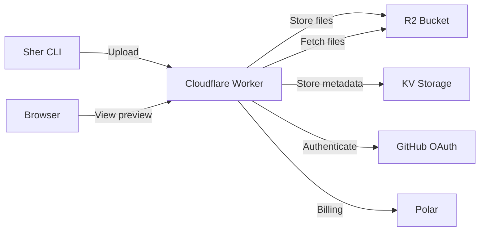

Sher is designed to be self-hosted. The entire backend runs on Cloudflare Workers with R2 for file storage, making it cost-effective and globally distributed.

<Note>
  This guide assumes you have a Cloudflare account and basic familiarity with Wrangler (Cloudflare's CLI).
</Note>

## Architecture

Sher's backend consists of:

- **Cloudflare Workers:** Handles authentication, uploads, and serving preview links
- **Cloudflare R2:** Stores uploaded build files (S3-compatible object storage)
- **KV Storage:** Stores deployment metadata and user sessions
- **GitHub OAuth:** User authentication (optional)
- **Polar:** Billing integration for Pro subscriptions (optional)



## Prerequisites

- [Cloudflare account](https://dash.cloudflare.com/sign-up) with Workers and R2 enabled
- [Wrangler CLI](https://developers.cloudflare.com/workers/wrangler/install-and-update/) installed
- [GitHub OAuth App](https://github.com/settings/developers) (optional, for authentication)
- [Polar account](https://polar.sh) (optional, for Pro subscriptions)

## Step 1: Deploy the Worker

### Clone and Install

First, navigate to the worker directory in the Sher repository:

```bash
cd worker
npm install
```

### Authenticate with Cloudflare

Login to Cloudflare via Wrangler:

```bash
npx wrangler login
```

This opens a browser window to authorize Wrangler with your Cloudflare account.

### Create R2 Bucket

Create an R2 bucket for storing uploaded files:

```bash
npx wrangler r2 bucket create sher-uploads
```

<Tip>
  You can use any name for the bucket. Make sure it matches the binding in `wrangler.toml`.
</Tip>

### Create KV Namespace

Create a KV namespace for storing metadata:

```bash
npx wrangler kv namespace create KV
```

This command outputs a namespace ID like:

```bash
✨ Success! Created KV namespace "KV"
📋 Namespace ID: 1234567890abcdef1234567890abcdef
```

**Update `wrangler.toml`** with the namespace ID:

```toml
[[kv_namespaces]]
binding = "KV"
id = "1234567890abcdef1234567890abcdef"  # Use your actual ID
```

### Deploy the Worker

Deploy to Cloudflare:

```bash
npx wrangler deploy
```

You'll see output like:

```bash
Your worker has been deployed
URL: https://sher.your-subdomain.workers.dev
```

<Info>
  By default, your worker is deployed to a `workers.dev` subdomain. You can add a custom domain later in the Cloudflare dashboard.
</Info>

## Step 2: Set Up GitHub OAuth (Optional)

To enable user authentication, create a GitHub OAuth App.

### Create OAuth App

1. Go to [github.com/settings/developers](https://github.com/settings/developers)
2. Click "New OAuth App"
3. Fill in the details:
   - **Application name:** Sher (or your custom name)
   - **Homepage URL:** `https://your-domain.workers.dev`
   - **Authorization callback URL:** `https://your-domain.workers.dev/auth/callback`
4. Click "Register application"

### Add Secrets to Worker

After creating the OAuth App, note the **Client ID** and **Client Secret**.

Add them as secrets to your worker:

```bash
npx wrangler secret put GITHUB_CLIENT_ID
# Paste your Client ID when prompted

npx wrangler secret put GITHUB_CLIENT_SECRET
# Paste your Client Secret when prompted
```

<Warning>
  Never commit these secrets to version control. Wrangler stores them securely in Cloudflare.
</Warning>

### Test Authentication

Test the login flow:

```bash
export SHER_API_URL=https://your-domain.workers.dev
sher login
```

This should open a browser window to authorize with GitHub.

## Step 3: Configure Secrets

Sher requires a few environment variables for full functionality.

### Required Secrets (with GitHub OAuth)

```bash
# GitHub OAuth (already set in Step 2)
npx wrangler secret put GITHUB_CLIENT_ID
npx wrangler secret put GITHUB_CLIENT_SECRET
```

### Optional Secrets (for Polar billing)

If you want to enable Pro subscriptions via [Polar](https://polar.sh):

```bash
npx wrangler secret put POLAR_WEBHOOK_SECRET
npx wrangler secret put POLAR_ACCESS_TOKEN
npx wrangler secret put POLAR_PRO_PRODUCT_ID
```

**Where to find these values:**

- **POLAR_WEBHOOK_SECRET:** Generated when you create a webhook in your Polar dashboard
- **POLAR_ACCESS_TOKEN:** Create an API token in Polar settings
- **POLAR_PRO_PRODUCT_ID:** The product ID for your Pro subscription (from Polar)

<Accordion title="How to set up Polar billing">
  1. Create a [Polar account](https://polar.sh) and set up your organization
  2. Create a product for "Sher Pro" priced at $8/month
  3. Note the product ID from the Polar dashboard
  4. Create an API token in Polar settings
  5. Create a webhook pointing to `https://your-domain.workers.dev/webhooks/polar`
  6. Add the secrets to your worker using `wrangler secret put`
</Accordion>

## Step 4: Point the CLI at Your Instance

Configure the Sher CLI to use your self-hosted instance instead of the default `sher.sh`.

### Set Environment Variable

Add to your shell configuration (`~/.bashrc`, `~/.zshrc`, etc.):

```bash
export SHER_API_URL=https://your-domain.workers.dev
```

Reload your shell:

```bash
source ~/.bashrc  # or ~/.zshrc
```

### Test Your Instance

```bash
sher link
```

You should see output similar to:

```bash
  sher — share your work

  framework  Vite
  building   npm run build

  files      12 files (194KB)

  https://a8xk2m1p.your-domain.workers.dev  (copied)
  expires 2/19/2026, 11:00 AM
```

<Tip>
  If you have multiple team members, they can all point their CLI at your self-hosted instance using the same environment variable.
</Tip>

## Configuration Options

### Custom Domain

To use a custom domain (e.g., `sher.yourdomain.com`):

1. Add a CNAME record in your DNS provider pointing to your worker:
   ```
   sher.yourdomain.com → your-subdomain.workers.dev
   ```

2. Add the custom domain in the Cloudflare dashboard:
   - Go to Workers & Pages → Your worker → Settings → Domains
   - Click "Add Custom Domain"
   - Enter your domain and click "Add Domain"

3. Update your CLI configuration:
   ```bash
   export SHER_API_URL=https://sher.yourdomain.com
   ```

### Adjusting Limits

You can customize rate limits and upload sizes by editing the worker code.

Example from the worker source (these are the default values):

```js
const LIMITS = {
  anon: {
    linksPerDay: 1,
    maxTTL: 6,
    maxUploadSize: 10 * 1024 * 1024, // 10 MB
  },
  auth: {
    linksPerDay: 25,
    maxTTL: 24,
    maxUploadSize: 50 * 1024 * 1024, // 50 MB
  },
  pro: {
    linksPerDay: 200,
    maxTTL: 168,
    maxUploadSize: 100 * 1024 * 1024, // 100 MB
  },
};
```

After editing, redeploy:

```bash
npx wrangler deploy
```

## Monitoring and Maintenance

### View Logs

Stream real-time logs from your worker:

```bash
npx wrangler tail
```

### Check Analytics

View usage analytics in the Cloudflare dashboard:

1. Go to Workers & Pages → Your worker
2. Click on "Metrics" tab
3. View requests, errors, and performance data

### R2 Storage

Monitor R2 usage:

```bash
npx wrangler r2 bucket list
```

<Info>
  R2 storage is very cost-effective. The first 10 GB/month is free, then $0.015/GB/month.
</Info>

## Troubleshooting

<AccordionGroup>
  <Accordion title="Authentication fails">
    Ensure your GitHub OAuth callback URL matches exactly:
    
    ```
    https://your-domain.workers.dev/auth/callback
    ```
    
    Check that `GITHUB_CLIENT_ID` and `GITHUB_CLIENT_SECRET` are set correctly:
    
    ```bash
    npx wrangler secret list
    ```
  </Accordion>

  <Accordion title="Uploads fail">
    Verify your R2 bucket name matches the binding in `wrangler.toml`:
    
    ```toml
    [[r2_buckets]]
    binding = "BUCKET"
    bucket_name = "sher-uploads"  # Must match your bucket
    ```
    
    Check R2 bucket permissions in the Cloudflare dashboard.
  </Accordion>

  <Accordion title="Rate limits not working">
    Ensure your KV namespace is correctly bound:
    
    ```bash
    npx wrangler kv namespace list
    ```
    
    The ID in `wrangler.toml` must match your KV namespace ID.
  </Accordion>

  <Accordion title="Custom domain not working">
    Verify DNS propagation:
    
    ```bash
    dig sher.yourdomain.com
    ```
    
    Ensure the CNAME points to your `workers.dev` subdomain.
  </Accordion>
</AccordionGroup>

## Updating Your Instance

To update your self-hosted instance with the latest changes:

```bash
git pull origin main
cd worker
npm install
npx wrangler deploy
```

<Warning>
  Always review the changelog before updating to ensure no breaking changes affect your configuration.
</Warning>

## Cost Estimate

Cloudflare's pricing is very generous for self-hosting:

| Service | Free Tier | Pricing |
|---------|-----------|--------|
| Workers | 100,000 requests/day | $0.50/million requests |
| R2 Storage | 10 GB/month | $0.015/GB/month |
| R2 Operations | Class A: 1M/month<br/>Class B: 10M/month | Class A: $4.50/million<br/>Class B: $0.36/million |
| KV Storage | 1 GB | $0.50/GB/month |

**Typical costs for moderate use:** $0-5/month

<Tip>
  For most small teams, self-hosting falls entirely within Cloudflare's free tier.
</Tip>

## Security Considerations

- **Secrets:** Always use `wrangler secret put` — never commit secrets to version control
- **OAuth:** Keep your GitHub OAuth Client Secret secure
- **Rate limiting:** Implement IP-based rate limiting if needed
- **CORS:** Configure CORS headers appropriately for your domain
- **Content validation:** The worker validates file types and sizes

## Next Steps

<CardGroup cols={2}>
  <Card title="CLI Options" href="/guides/options" icon="flag">
    Learn about all CLI flags and options
  </Card>
  <Card title="Framework Support" href="/guides/frameworks" icon="wrench">
    See which frameworks are supported
  </Card>
  <Card title="Commands" href="/commands/link" icon="terminal">
    Explore all available commands
  </Card>
  <Card title="Contributing" href="https://github.com/sherdotsh/sher" icon="github">
    Contribute to Sher on GitHub
  </Card>
</CardGroup>
